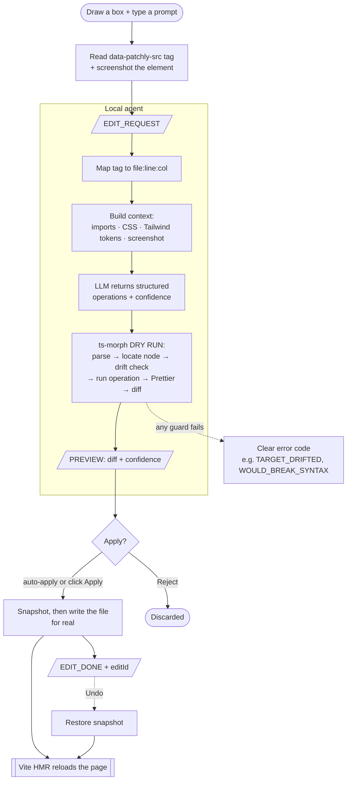

# Patchly

**Select any area of your running localhost app. Describe the change. Watch the code update.**

No hunting through files. No searching for classNames. Just point and fix — Patchly maps
your selection back to the exact source element, edits the file, and your dev server hot-reloads.

<!-- TODO: record a GIF of the full workflow and embed it here -->

---

## Quick start (2 steps)

**1. In your React + Vite project:**
```bash
npx patchly init
```
Follow the printed instructions to add `patchlyPlugin()` to your `vite.config.js`
(skipped automatically if it's already there), then add your Azure OpenAI credentials
to the generated `.patchlyrc.json`.

**2. Build and load the Chrome extension:**
```bash
npm run build:ext        # bundles TypeScript → extension/dist/
```
Open `chrome://extensions`, enable Developer Mode, and "Load unpacked" the
`extension/dist/` folder.

> Reloading the extension after pulling changes? Run `npm run build:ext` first,
> then hit ↻ on the Patchly card in `chrome://extensions` — Chrome caches the
> content scripts until you do.

---

## Usage

1. Run `npx patchly` in your project folder (starts the local agent on port `7842`)
2. Open your app at `http://localhost:5173`
3. **Click the Patchly toolbar icon** to turn on editing mode — a floating toolbar appears at the
   top of the page with **AI Mode** / **Tailwind Mode** tabs, undo/redo, settings, and a connection dot
4. **AI Mode** — hover to highlight; **click** an element (or **click-and-drag** a box over an area),
   then describe the change in the prompt and hit Enter
5. Review the **diff preview** with its confidence score, then click **Apply** (or press `Enter`) —
   your code updates and the browser hot-reloads
6. **Tailwind Mode** — **click** an element (or **Ctrl/Cmd+Click** several) to open the inspector
   sidebar and edit Tailwind classes directly, no AI involved

Made a mistake? Use the toolbar **Undo** (AI edits) or the inspector's **Undo/Redo** (class edits).
Click the icon again, the toolbar **×**, or press **Esc** to exit editing mode.

---

## What it can do

- **Click-to-activate editing mode** — clicking the toolbar icon toggles a floating, color-picker–style
  toolbar with **AI** / **Tailwind** mode tabs, undo/redo, settings, and an agent-connection dot.
- **Point-and-edit** — in AI mode, click an element or drag a box over an area; Patchly resolves it
  to the exact source line. The prompt is an auto-growing textarea.
- **Diff preview before writing** — every edit is dry-run first and shown as a color-coded diff
  with a model **confidence score**. Nothing touches your files until you Apply.
- **One-click undo** — the toolbar **Undo** reverts the most recent AI edit.
- **Confidence-gated auto-apply** *(opt-in)* — turn on auto-apply in the toolbar settings and set a
  threshold (0.7 – 0.95); high-confidence edits apply straight away, lower-confidence ones still ask
  first. Off by default — you always see the diff.
- **Multi-component batch edits** — select several elements at once; Patchly groups them by file
  and applies one coherent change across all of them.
- **Cross-file redirect** — select a parent and describe a change that actually lives in a child
  component, and Patchly suggests the right child file (deduced from its imports) and offers a
  one-click "Edit that component instead".
- **Design-token aware** — the model is fed your Tailwind config tokens, global CSS, and a
  screenshot of the selection, so edits use *your* brand colors and spacing, not generic guesses.
- **Tailwind Mode (no AI)** — switch to the **Tailwind Mode** tab and **click** (or **Ctrl/Cmd+Click**
  several) elements to open a docked, Figma-style inspector. See each element's Tailwind classes as
  devtools-style toggle rows, flip them on/off, remove them, or search a built-in catalog
  (`items-center`, `hover:bg-…`, your theme colors) and click to add. Multi-select shows an
  **Apply-to-all** bar plus **per-element sections** so you can target specific elements. Edits write
  instantly with Tailwind conflict resolution; the inspector has its **own** undo/redo, separate from
  AI edits.

---

## Requirements

- React + Vite + Tailwind CSS (the AI is instructed to write Tailwind classes only)
- Node.js 18+
- Chrome browser
- Azure OpenAI API key (add it to `.patchlyrc.json`, created by `npx patchly init`)

---

## Why Patchly?

Tweaking a running UI usually means breaking flow: spot the thing on screen, hunt for the file,
scan for the right className buried among a dozen others, edit, alt-tab back, repeat. Browser
devtools let you experiment, but the changes evaporate on reload — they never reach your source.

Patchly closes that gap. You point at what you see and say what you want; the change lands in the
actual source file and hot-reloads. What makes it trustworthy rather than just convenient:

- **It edits the real source, not the DOM.** Changes are permanent and live in your repo, not lost on refresh.
- **It targets the exact node.** A fingerprint/drift check means it never edits the wrong element if the file shifted since you selected.
- **It shows its work first.** Every edit is previewed as a diff with a confidence score before anything is written.
- **It can't corrupt your files.** Edits are AST-based (ts-morph), syntax-checked, and confined to your project — never `node_modules`, `.git`, or config files.
- **Your code stays yours.** Everything runs locally; only your prompt and the relevant context go to the LLM provider you chose. Zero telemetry.

---

## Architecture

Patchly is three cooperating pieces. The browser side never touches your files; the agent side
never sees your screen. They talk over a single local WebSocket.

```
┌─────────────────────────────┐         ┌──────────────────────────────────────┐
│  Chrome extension (MV3)      │         │  Local Node agent  (port 7842)         │
│                              │         │                                        │
│  • floating toolbar          │ ──WS──► │  • source mapper (data-patchly-src →   │
│  • selection overlay         │ EDIT_   │      file:line:col)                    │
│  • AI prompt bar             │ REQUEST │  • context builder (imports, CSS,      │
│  • Tailwind class inspector  │         │      Tailwind tokens)                  │
│  • diff-preview panel        │ ◄──WS── │  • LLM client (Azure OpenAI)           │
│  • screenshot capture        │ PREVIEW │  • AST editing engine (ts-morph)       │
└─────────────────────────────┘ /DONE   │  • safety rails + undo snapshots       │
            ▲                            └──────────────────┬─────────────────────┘
            │                                               │ writes file
            │        Vite dev server (your app)             ▼
            └──────────  HMR reloads the page  ◄────  your source files
```

| Folder | What it is | Responsibilities |
|--------|------------|------------------|
| `extension/` | Chrome MV3 extension (TypeScript, built by esbuild → `extension/dist/`) | Everything the user sees and touches: the floating toolbar, selection overlay, AI prompt bar, Tailwind class inspector, screenshot capture, and diff-preview panel. Holds settings + API key in `chrome.storage.local`. Activated by clicking the toolbar icon. |
| `agent/` | Local Node 20+ process | The WebSocket server, source mapping, context building, LLM calls, the ts-morph AST editing engine, the safety rails, and in-memory undo snapshots. This is the only component that reads or writes your files. |
| `shared/` | Common contracts | The message protocol (every WebSocket message type + the registry of error codes) and the **edit-operation schema** — the structured description of a change, deliberately kept LLM-independent. |

A separate **Vite plugin** runs inside your app's dev server (not in `agent/` or `extension/`). At
startup it instruments your JSX so every rendered element carries a `data-patchly-src="file:line:col"`
attribute. This tag is the bridge: it's how a pixel on screen becomes a precise location in source.

---

## The end-to-end flow

The journey of one edit, from a box drawn on screen to a changed line on disk:



> Batch (multi-select) edits run the same pipeline, but the agent groups targets **by file**, sends
> each file to the LLM once, and applies a file's operations **bottom-to-top** so line shifts can't
> invalidate edits above them. Each file gets its own preview card and history row. The numbered
> stages below break down each box in this graph.

### 1. Selection → a precise source location
You turn on editing mode (toolbar icon) and, in AI mode, click an element or drag a box. The overlay
resolves your selection to the best-matching DOM element and reads its `data-patchly-src` tag. It also captures a cropped **screenshot** of just that
element and grabs its current classes/markup. All of this is bundled into an `EDIT_REQUEST` and sent
to the agent over the WebSocket, along with your natural-language prompt.

### 2. Source mapping
The agent takes the `file:line:col` from the tag and resolves it against your project — confirming
the file is inside the project root and the line exists. If the tag is missing or malformed, it
stops here with a clear error code (`NO_SOURCE_ATTR`, `INVALID_SRC_FORMAT`, `LINE_OUT_OF_RANGE`)
rather than guessing.

### 3. Context building
Before calling the model, the agent assembles a focused context package: the target element's
source, its file's **import statements**, relevant **global CSS**, and your **Tailwind config
tokens** (brand colors, spacing, etc., parsed without `eval`). The screenshot is attached as a
vision input. This is what lets edits use *your* design system instead of generic defaults — and
it's also how the model can tell that a change really belongs to an imported child component.

### 4. LLM → a structured edit operation
The model does **not** return code or a find/replace. It returns a structured **edit operation** (or
several) from a fixed vocabulary:

| Operation | What it does |
|-----------|--------------|
| `setClassName` | add / remove classes |
| `setAttribute` | add, change, or remove an attribute |
| `setText` | replace an element's text |
| `setInlineStyle` | set inline style properties |
| `wrapElement` | wrap a target in a new element |
| `insertChild` | insert new JSX as a child |
| `replaceElement` | swap an element for new JSX |
| `removeElement` | delete an element |

Each operation points at an `EditTarget` (file, line, column, tag name, and a small **fingerprint**
of identifying attributes/text). The model also returns a one-sentence explanation and a
self-rated **confidence** (0–1). Because this operation schema is LLM-independent, the very same
operations could later be produced by a drag-and-drop UI with no model in the loop.

If the model decides the change actually lives in an imported child (e.g. you selected a table
header but the thing to restyle is rendered by a `UserRow` component), it returns a **redirect**
suggestion instead of guessing positions in the wrong file. The agent forwards that as a `REDIRECT`
message, and the extension offers a one-click "edit that component instead" (locating the child's
rendered element in the page by climbing out from your selection).

### 5. AST edit + drift guard (dry run first)
The agent feeds the operations into the **ts-morph** AST engine. Before mutating, it re-locates the
target node and runs a **drift check**: it confirms the node at that line still matches the
fingerprint. If the file changed since you selected (the node moved, was deleted, or is now
ambiguous), it aborts with `TARGET_DRIFTED` — it will never edit the wrong element. It also refuses
edits it can't do safely (e.g. a dynamic `clsx()` className → `DYNAMIC_CLASSNAME`).

The mutation is **surgical**: it changes only the targeted node, then runs Prettier using your
project's own config, so a one-element edit produces a diff of only the changed lines — no whole-file
reflow. This whole step runs as a **dry run** first: it computes the resulting unified **diff**
without writing anything, and the agent checks that the result would still be valid syntax
(`WOULD_BREAK_SYNTAX` otherwise).

### 6. Preview → confirm → write → reload
The agent sends a `PREVIEW` back with the diff, confidence, and file/line. The extension renders the
color-coded diff with a confidence chip and waits:

- **Manual (default):** you read the diff and click **Apply** (`Enter`) or **Reject** (`Esc`).
- **Auto-apply (opt-in):** if you've enabled it in the toolbar settings and the confidence meets your
  threshold (0.7–0.95), it applies immediately; anything below still shows the diff.

Only an explicit **confirm** causes the agent to write the file (the same AST pipeline, now for
real). Before writing it snapshots the file's previous contents for undo. The write lands on disk,
Vite's HMR picks it up, and the page reloads. The agent replies `EDIT_DONE` with an `editId`; the
toolbar **Undo** reverts the most recent edit.

> **Tailwind Mode** is a separate, LLM-free path: `INSPECT` reads an element's classes from source,
> and class toggles/adds send `APPLY_OPS` straight to the AST engine (no preview, no AI). These edits
> are **not** recorded in the AI undo — the inspector keeps its own undo/redo.

### 7. Undo
Every applied AI edit gets its own `editId` and a stored snapshot on the agent. The toolbar **Undo**
sends `UNDO` and the agent restores the most recent edit's snapshot. (Known limitation: if two edits
touched the same file, undoing restores its whole snapshot — last-write-wins, no per-hunk stacking.
Acceptable for v2.) Tailwind-mode class edits are stateless on the agent and undone/redone entirely
in the inspector by re-applying the inverse operations.

### Batch edits (multi-select fan-out)
When you select several elements at once, the agent **groups the targets by file** and sends each
file to the model exactly once (with all of that file's targets), rather than once per element. This
saves tokens and avoids the drift you'd get from stitching independent single-target responses
together. Operations within a file are applied **bottom-to-top** so a line-shifting edit can't
invalidate the line numbers of edits above it. Each file produces its own preview card and, on
confirm, its own history entry.

---

## Safety model

- **Filesystem boundaries.** The agent never writes outside your project root and never touches
  `node_modules`, `.git`, build output (`dist`/`build`/`.next`/`out`), or config/lock files
  (`PATH_TRAVERSAL`, `FORBIDDEN_PATH`, `FORBIDDEN_FILE`).
- **Never the wrong node.** The drift/fingerprint check aborts rather than edit a node that moved or
  changed since selection.
- **Never broken syntax.** Edits are dry-run and syntax-checked before any write; a change that
  would break the file fails with a clear code instead of corrupting it.
- **Preview by default.** Nothing is written without either your click or an auto-apply rule you
  explicitly turned on.
- **Privacy.** Your code stays on your machine. Your API key stays in `chrome.storage.local` and
  never leaves the machine except to the LLM provider you configured. Zero telemetry.

---

## MCP server — editor-agnostic element editing

Patchly ships a local [MCP (Model Context Protocol)](https://modelcontextprotocol.io) server so any
MCP-capable coding agent (Claude Code, Cline, Windsurf, Cursor) can inspect and edit the element the
user is currently pointing at in the browser — with no LLM in the edit path and all of Patchly's
safety rails intact.

### How it works

The MCP server is a thin stdio process. It does **not** re-implement any editing logic. It connects
as a WebSocket client to the already-running `patchly` agent and proxies requests to it. The agent
remains the single source of truth for selection state and all file writes.

```
Coding agent ⇄ (stdio/MCP) ⇄ patchly mcp ⇄ (ws://localhost:7842) ⇄ patchly agent ⇄ source files
                                                       ↑
                           Chrome extension also connected (pushes SELECTION_UPDATE)
```

When the user selects an element in the browser, the extension pushes the selection to the agent's
in-memory cache (`SELECTION_UPDATE`). The MCP server can then retrieve it instantly without touching
the DOM.

### Starting the MCP server

```bash
# development (no compile step)
npm run mcp

# production (after npm run build)
npx patchly mcp
```

The server requires the patchly agent to already be running (`npx patchly` in your project). If the
agent isn't up, every tool call returns a clear error: *"Patchly agent not found — run `npx patchly`
in your project first."*

### Claude Code setup

A `.mcp.json` is included at the repo root. Open this repo in Claude Code and it will detect and
offer to enable the `patchly` server automatically.

For other MCP clients, add this to their MCP config (pointing `cwd` at the Patchly repo root):

```json
{
  "mcpServers": {
    "patchly": {
      "command": "npm",
      "args": ["run", "mcp"]
    }
  }
}
```

### MCP tools

| Tool | Description |
|------|-------------|
| `patchly_current_selection` | Returns the element(s) currently selected in the browser. Includes source file/line/column, tag name, and source-accurate className breakdown (`classNameKind`: static \| dynamic \| none, plus class token list). Auto-inspects via AST — no second tool call needed. |
| `patchly_inspect(patchlySrc)` | Reads an element's className straight from source for a specific `data-patchly-src` pointer. Useful when you know the source location but haven't selected it. Read-only. |
| `patchly_apply(operation, dryRun?)` | Applies one `EditOperation` (same schema as the LLM path — `setClassName`, `setAttribute`, `setText`, `setInlineStyle`, `wrapElement`, `insertChild`, `replaceElement`, `removeElement`). If `operation.target` is omitted, the current browser selection is used automatically. Always returns the unified diff. Set `dryRun: true` to preview without writing. |

### Typical workflow

```
user selects element in browser
  → agent calls patchly_current_selection()
    → gets { file, line, column, tag, classNameKind, classes }
  → agent calls patchly_apply({ op: "setClassName", add: ["..."], remove: ["..."] })
    → source file is edited, HMR reloads the page, diff is returned
```

All of Patchly's safety rails apply: no writes outside the project root, drift/fingerprint check
before every edit, syntax guard (pre- and post-edit), and Prettier formatting. The apply path uses
`APPLY_OPS`, which is deliberately **not** recorded in the AI edit history — MCP edits stay out of
the extension's undo sidebar.

---

## Message protocol (at a glance)

All extension ↔ agent communication uses a small set of typed messages over the WebSocket:

| Direction | Message | Meaning |
|-----------|---------|---------|
| ext → agent | `EDIT_REQUEST` | a selection + prompt (single or multi-target batch) |
| agent → ext | `PROGRESS` | live status while preparing the edit (analyzing / generating / building) |
| agent → ext | `PREVIEW` / `PREVIEW_BATCH` | the dry-run diff(s) + confidence, awaiting confirm |
| agent → ext | `REDIRECT` | "this change lives in an imported child component" suggestion |
| ext → agent | `CONFIRM` / `REJECT` | apply or discard the pending edit |
| agent → ext | `EDIT_DONE` | edit written; carries the `editId` for history + undo |
| ext → agent | `UNDO` | revert a specific `editId` (or the most recent) |
| agent → ext | `UNDO_DONE` | the revert completed |
| agent → ext | `EDIT_ERROR` / `INFO` | a failure with an error code, or an informational note |
| ext → agent | `INSPECT` | read element className(s) from source (Tailwind Mode + MCP) |
| agent → ext | `ELEMENT_INFO` | source-accurate className breakdown (static/dynamic/none) |
| ext → agent | `APPLY_OPS` | apply pre-built operations directly — no LLM, no preview (Tailwind Mode + MCP) |
| agent → ext | `OPS_APPLIED` | ops applied; carries the unified diff; not recorded in AI history |
| ext → agent | `SELECTION_UPDATE` | extension pushes current browser selection to the agent cache (MCP bridge) |
| mcp → agent | `GET_SELECTION` | MCP server requests the cached selection |
| agent → mcp | `SELECTION` | the cached selection items (empty array if nothing selected) |

---

## Development

The entire project is TypeScript (`strict: true`). Two separate build pipelines:

| Target | Dev | Production |
|--------|-----|------------|
| `agent/` + `shared/` + `vite-plugin/` | `npm run dev` (tsx, runs .ts directly) | `npm run build` (tsc → `dist/`) |
| `extension/` | `npm run watch:ext` (esbuild --watch → `extension/dist/`) | `npm run build:ext` (esbuild → `extension/dist/`) |

```bash
# Run tests (71 AST regression tests)
npm test

# Type-check both tsconfigs
npm run typecheck

# Start agent in dev mode
npm run dev

# Start MCP server in dev mode (requires agent already running)
npm run mcp

# Build + watch extension (reload unpacked after each change)
npm run watch:ext
```

After any extension source change: run `build:ext` (or `watch:ext` handles it), then hit ↻ in
`chrome://extensions`.

---

## Status

**v0.1.0** — React + Vite + Tailwind. Early release.

Working today: click-to-activate floating toolbar, AST-based editing engine, visual + design-token
context, diff preview, one-click undo, confidence-gated auto-apply, batch edits, cross-file redirect,
a direct Tailwind-class inspector (multi-select, per-element + apply-to-all), and an **MCP server**
that exposes browser selection + source-mapped editing to any MCP-capable coding agent.

On the roadmap: multi-provider LLM support, Next.js, and Chrome Web Store distribution.
