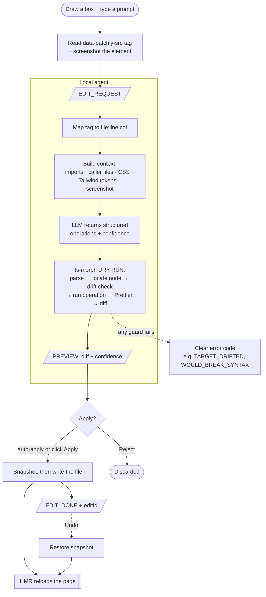

# Patchly

**Select any element on your running app. Describe the change. Watch the code update.**

No hunting through files. No searching for classNames. Just point and fix — Patchly maps your
selection back to the exact source element, edits the file, and your dev server hot-reloads.

<!-- TODO: record a GIF of the full workflow and embed it here -->

---

## What Patchly is

Patchly has two complementary sides:

**Developer editing** — A Chrome extension + local agent that lets you click any element on your localhost app and make AI-powered or direct Tailwind edits that write back to your source files via HMR. No file hunting. No className archaeology. Point, describe, done.

**Client review** — A zero-install web overlay that lets clients or teammates leave numbered comment pins directly on your running app (via a shared tunnel URL). Comments sync to the dev in real time. The dev can then resolve, fix with AI, or edit Tailwind classes — all from the same toolbar.

---

## Quick start

### 1. Vite project

```bash
npx patchly init
```

Follow the printed instructions to add `patchlyPlugin()` to your `vite.config.js` and add your LLM credentials to `.patchlyrc.json`.

### 2. Next.js project

```js
// next.config.js
import { withPatchly } from 'patchly/next'
export default withPatchly(nextConfig)
```

Add `<PatchlyReview />` to your root layout to inject the client reviewer overlay on tunnel/preview URLs.

### 3. Load the extension

```bash
npm run build:ext        # bundles TypeScript → extension/dist/
```

Open `chrome://extensions`, enable Developer Mode, and "Load unpacked" the `extension/dist/` folder.

### 4. Run the agent

```bash
npm run dev              # starts the local WebSocket agent on port 7842
```

---

## Usage

### Developer editing

1. Open your app at `http://localhost:PORT`
2. **Click the Patchly toolbar icon** — a floating toolbar appears with **AI Mode / Tailwind Mode / Comment** tabs, undo/redo, a show/hide pins toggle, settings, and a connection dot
3. **AI Mode** — hover to highlight elements; **click** one (or **drag** a box over an area), describe the change in the prompt bar, and hit Enter
4. Review the **diff preview** with its confidence score — click **Apply** (or `Enter`) to write the file
5. **Tailwind Mode** — **click** (or **Ctrl/Cmd+Click** several elements) to open the class inspector sidebar and toggle/add/remove Tailwind classes directly with no AI
6. **Comment Mode** — review your clients' comment pins, reply to threads, or click **Fix with AI** / **Edit classes** / **Resolve** on each comment

Made a mistake? Use the toolbar **Undo** (AI edits) or the inspector's **Undo/Redo** (class edits).
Close with the toolbar **×**, **Esc**, or clicking the icon again.

### Client review (tunnel URL)

1. Dev runs `cloudflared tunnel --url http://localhost:PORT` (or ngrok, etc.) and shares the URL
2. Reviewer opens the URL — a **+** button appears in the bottom-right (no install required)
3. Reviewer clicks **+**, hovers to highlight an element, clicks to leave a **comment pin**
4. Comments sync to the dev's extension within 3 seconds; the dev sees numbered pins overlaid on the page
5. Dev opens any pin card to read the note, reply, fix with AI, or resolve

---

## What it can do

### AI editing
- **Point-and-edit** — click or drag-box; Patchly resolves the selection to the exact source line via `data-patchly-src` instrumentation
- **Diff preview before writing** — every edit is dry-run first; you see a color-coded diff with a **confidence score** before anything touches your files
- **One-click undo** — the toolbar Undo reverts the most recent AI edit; button is disabled until you've made one
- **Confidence-gated auto-apply** *(opt-in)* — set a threshold (0.7–0.95) in settings; high-confidence edits apply instantly, lower ones still ask
- **Multi-component batch edits** — select multiple elements; Patchly groups them by file and applies one coherent LLM call per file
- **Cross-file redirect** — select a parent but the real change is in a child component; Patchly detects this and offers one-click "edit that component instead"
- **Caller-context editing** — when an element's content comes from a prop (e.g. `{value}`), Patchly automatically finds the caller file, shows it to the LLM, and edits the prop at the call site — not the component template
- **Design-token aware** — the model receives your Tailwind config tokens, global CSS, and a screenshot of the selected element; edits use your brand colors and spacing

### Tailwind Mode (no AI)
- Click or multi-select elements to open the **class inspector** sidebar
- Toggle Tailwind classes on/off, remove them, or search a built-in catalog (`hover:bg-…`, your theme colors) and click to add
- Multi-select shows an **Apply-to-all** bar + per-element sections for targeting specific elements
- Instant writes with Tailwind conflict resolution; its own undo/redo stack, separate from AI edits
- Hover over elements in the sidebar to highlight them in the DOM

### Comment Mode (client review)
- **Show/hide pins toggle** in the toolbar (persists across sessions); pins always force-show in Comment mode
- Numbered comment pins positioned at the commented element; spread when overlapping
- Each pin card shows: author, timestamp, note text, screenshot thumbnail, reply thread
- **Fix with AI** — pre-fills the AI prompt bar with the reviewer's note and selects the element
- **Edit classes** — opens the Tailwind inspector for the commented element
- **Resolve** — deletes the comment and removes the pin
- **Reply threads** — both dev and reviewer can reply; replies sync within 3 seconds via polling
- Pins visible in all modes when toggle is ON; always shown in Comment mode regardless of toggle
- After closing the toolbar (Esc), pins stay visible in read-only mode (view + reply only)

### MCP server
Give any coding agent (Claude Code, Copilot, Cline, Cursor) eyes on the browser. See [MCP server](#mcp-server--give-any-coding-agent-eyes-on-the-browser) below.

---

## Review Comments — cloud setup

The reviewer overlay uses a cloud backend (MongoDB + NextAuth + UploadThing) to store comments so they sync across origins (localhost ↔ tunnel URL ↔ beta deploy).

### Dashboard (`packages/web/`)

A Next.js 16 App Router web app that serves as the Patchly control plane:

- **Projects** — create a project, get a dev token and project ID
- **Review links** — create share tokens to give to clients (scoped, expirable, revocable)
- **Comments view** — see all open/resolved comments with screenshots, tags, and reply threads
- **Team members** — invite teammates via invite link; GitHub OAuth identity

### Environment setup

**Agent** (`.env` in the project root):
```
PATCHLY_CLOUD_API_URL=http://localhost:3000
PATCHLY_DEV_TOKEN=<your-dev-token-from-dashboard>
PATCHLY_PROJECT_ID=<your-project-id-from-dashboard>
```

**Next.js demo app** (`.env.local` in the Next.js project):
```
NEXT_PUBLIC_PATCHLY_REVIEW_TOKEN=<link-token-from-dashboard>
NEXT_PUBLIC_PATCHLY_CLOUD_HOST=http://localhost:3000
```

**Dashboard** (`packages/web/.env.local`):
```
MONGODB_URI=<your-mongodb-atlas-uri>
AUTH_SECRET=<random-secret>
GITHUB_CLIENT_ID=<oauth-app-client-id>
GITHUB_CLIENT_SECRET=<oauth-app-client-secret>
UPLOADTHING_TOKEN=<uploadthing-token>
```

### Auth flow

Developers sign in with GitHub via the extension toolbar (Comment mode → "Sign in with GitHub"). The sign-in page checks project membership and issues an identity token. This token proves **who you are** — it works across all projects you're a member of; changing `PATCHLY_PROJECT_ID` in `.env` never invalidates it.

Reviewers are anonymous by default — they pick a display name (stored in `localStorage`) and comment with a link token. No account required.

---

## Requirements

| Requirement | Notes |
|-------------|-------|
| React + Vite or Next.js | Vite plugin or `withPatchly()` Next.js wrapper required |
| Node.js 18+ | For the local agent |
| Chrome | Extension is Chrome MV3 |
| LLM provider | Azure OpenAI (multi-provider coming); add credentials to `.patchlyrc.json` |
| MongoDB Atlas | For cloud comment sync (optional — local file store works for solo dev use) |

---

## Why Patchly?

Tweaking a running UI usually means breaking flow: spot the thing on screen, hunt for the file, scan for the right className, edit, alt-tab back, repeat. Browser devtools let you experiment, but changes evaporate on reload.

Patchly closes that gap. You point at what you see and say what you want; the change lands in the actual source file and hot-reloads. What makes it trustworthy rather than just convenient:

- **It edits the real source, not the DOM.** Changes are permanent and live in your repo.
- **It targets the exact node.** A fingerprint/drift check means it never edits the wrong element if the file shifted since you selected.
- **It shows its work first.** Every edit is previewed as a diff with a confidence score before anything is written.
- **It can't corrupt your files.** Edits are AST-based (ts-morph), syntax-checked, and confined to your project — never `node_modules`, `.git`, or config files.
- **Your code stays yours.** Everything runs locally; only your prompt and the relevant context go to the LLM provider you chose. Zero telemetry.

---

## Architecture

Patchly is three cooperating pieces on the local side, plus an optional cloud backend for review comments.

```
┌─────────────────────────────┐         ┌──────────────────────────────────────┐
│  Chrome extension (MV3)      │         │  Local Node agent  (port 7842)        │
│                              │         │                                        │
│  • floating toolbar          │ ──WS──► │  • source mapper (data-patchly-src →  │
│  • AI Mode (selection +      │ EDIT_   │      file:line:col)                   │
│    prompt + diff preview)    │ REQUEST │  • context builder (imports, callers, │
│  • Tailwind class inspector  │         │      CSS, Tailwind tokens)            │
│  • Comment Mode (pins +      │ ◄──WS── │  • LLM client (Azure OpenAI)          │
│    cards + reply threads)    │ PREVIEW │  • AST editing engine (ts-morph)      │
│  • screenshot capture        │ /DONE   │  • safety rails + undo snapshots      │
└─────────────────────────────┘         │  • cloud comment proxy                │
            ▲                            └──────────────────┬────────────────────┘
            │                                               │ writes file
            │        Vite / Next.js dev server              ▼
            └────────────  HMR reloads  ◄──────  your source files

                    ┌─────────────────────────────────┐
                    │  Patchly Cloud (packages/web/)   │
                    │  Next.js 16 App Router           │
                    │  MongoDB + NextAuth + UploadThing │
                    │  • dashboard & review links       │
                    │  • /api/comments CRUD            │
                    │  • /patchly-overlay.js (served)  │
                    └──────────────┬──────────────────┘
                                   │ poll every 3s
                    ┌──────────────▼──────────────────┐
                    │  Reviewer (tunnel URL)           │
                    │  patchly-overlay.js (no install) │
                    │  • + button → comment pins       │
                    │  • reply threads                 │
                    │  • screenshot upload             │
                    └─────────────────────────────────┘
```

| Folder | What it is | Responsibilities |
|--------|------------|------------------|
| `extension/` | Chrome MV3 extension (TypeScript, built by esbuild → `extension/dist/`) | Floating toolbar, AI prompt bar, class inspector, comment pins, diff-preview panel, screenshot capture. Settings + auth token in `chrome.storage.local`. |
| `agent/` | Local Node 20+ process | WebSocket server, source mapping, context building (imports + caller files), LLM calls, ts-morph AST engine, safety rails, in-memory undo, cloud comment proxy. |
| `shared/` | Common contracts | WS message protocol + error codes, edit-operation schema (LLM-independent), comment types. |
| `vite-plugin/` | Vite plugin | Instruments JSX at startup to inject `data-patchly-src="file:line:col"` on every element. |
| `next-plugin/` | Next.js plugin | `withPatchly(nextConfig)` wrapper (webpack + Turbopack), `PatchlyReview` component that injects the reviewer overlay script. |
| `packages/web/` | Patchly Cloud dashboard | Next.js 16 App Router app: projects, review links, comments view, GitHub OAuth, UploadThing screenshots, and the `patchly-overlay.js` static file served to reviewers. |

---

## The end-to-end flow

### AI editing



### Review comment flow

```
Reviewer (tunnel URL)            Cloud API               Dev (localhost)
─────────────────────            ─────────               ───────────────
clicks + button
hovers → highlight
clicks element
fills composer ──────► POST /api/comments ──────────────► poll every 3s
submits                 (stores pagePath)                 pin appears on page
                                                          opens pin card
                                                          replies ────────► POST /api/.../replies
                        updates comment ◄─────────────────
pin card refreshes ◄─── poll response
(new reply visible)
```

Comments are matched across origins by `pagePath` (pathname only) — so a comment left on `https://tunnel.trycloudflare.com/` syncs to `http://localhost:3100/` because both have path `/`.

### Operation schema

The LLM returns structured **edit operations** (never raw code) from a fixed vocabulary:

| Operation | What it does |
|-----------|--------------|
| `setClassName` | Add / remove Tailwind class tokens |
| `setAttribute` | Add, change, or remove a JSX attribute (including prop values in caller files) |
| `setText` | Replace an element's plain-text content |
| `setInlineStyle` | Merge CSS properties into `style={{}}` |
| `setExpression` | Set a JSX attribute to any JavaScript expression (ternary, variable, function call) |
| `wrapElement` | Wrap the target in a new element |
| `insertChild` | Insert JSX as a child |
| `replaceElement` | Swap an element for new JSX (last resort) |
| `removeElement` | Delete an element |

Each operation carries an `EditTarget` (file, line, column, tag name, optional text snippet and `identifyingAttrs`). The schema is **LLM-independent** — the same operations can be produced by a drag-drop UI or the MCP server.

### Caller-context editing

When you select an element whose content comes from a prop (e.g. `<p>{value}</p>`), Patchly automatically:
1. Detects the component file and scans the project for files that use `<ComponentName …>`
2. Includes those caller files in the LLM context under `### Caller files`
3. Guides the LLM to emit `setAttribute` on the specific `<ComponentName prop="value">` call — not hardcode inside the component template
4. Uses `identifyingAttrs` (e.g. `{ "label": "Error rate" }`) to distinguish between multiple instances of the same component

---

## Safety model

- **Filesystem boundaries.** The agent never writes outside your project root; never touches `node_modules`, `.git`, build output, or config/lock files (`PATH_TRAVERSAL`, `FORBIDDEN_PATH`, `FORBIDDEN_FILE`).
- **Never the wrong node.** The drift/fingerprint check aborts rather than edit a node that moved or changed since selection (`TARGET_DRIFTED`).
- **Never broken syntax.** Edits are dry-run and syntax-checked before any write; a change that would break the file fails with a clear code (`WOULD_BREAK_SYNTAX`).
- **Preview by default.** Nothing is written without your click or an auto-apply rule you explicitly set.
- **Cross-file allow-list.** When the LLM targets a different file (e.g. a caller file), the server validates the file was explicitly included in the LLM context — arbitrary file writes are blocked.
- **Privacy.** Your code stays on your machine. Your API key stays in `chrome.storage.local`. Zero telemetry.

---

## MCP server — give any coding agent eyes on the browser

Patchly ships a local [MCP (Model Context Protocol)](https://modelcontextprotocol.io) server so any MCP-capable coding agent (Claude Code, GitHub Copilot, Cline, Windsurf, Cursor) can see what the user is pointing at in the browser.

```
Coding agent ⇄ (stdio/MCP) ⇄ patchly mcp ⇄ (ws, lockfile-discovered) ⇄ patchly agent ⇄ source files
                                                       ↑
                           Chrome extension also connected (pushes SELECTION_UPDATE)
```

### Starting the MCP server

```bash
npm run mcp          # development
npx patchly mcp      # production
```

### Client setup

**Claude Code** (`.mcp.json`):
```json
{ "mcpServers": { "patchly": { "command": "npx", "args": ["patchly", "mcp"] } } }
```

**GitHub Copilot** (`.vscode/mcp.json`):
```json
{ "servers": { "patchly": { "type": "stdio", "command": "npx", "args": ["patchly", "mcp"] } } }
```

### MCP tools

| Tool | Description |
|------|-------------|
| **`patchly_current_selection`** | **Primary tool.** Returns source file/line/col, tag, className breakdown, computed CSS styles, and a **screenshot** of the element as an MCP image block. |
| `patchly_inspect(patchlySrc)` | Read an element's className from source for a specific `data-patchly-src` pointer. Read-only. |
| `patchly_apply(operation, dryRun?)` | Deterministic fast-path for trivial edits. Applies one `EditOperation` with Patchly's full safety rails (drift check, syntax guard, Prettier, HMR). Returns the unified diff. |
| `patchly_list_comments(status?)` | List review comments for the project (`open` / `resolved` / `all`). Returns note, author, tag, page path, screenshot URL, and reply threads. |
| `patchly_resolve_comment(commentId)` | Mark a comment resolved and delete its screenshot. |
| `patchly_clear_comments(status?)` | Bulk-delete resolved (or all) comments. |
| `patchly_screenshot(patchlySrc?)` | Capture a screenshot of the current selection or a specific element. |

---

## Message protocol (at a glance)

| Direction | Message | Meaning |
|-----------|---------|---------|
| ext → agent | `EDIT_REQUEST` | Selection + prompt (single or batch) |
| agent → ext | `PROGRESS` | Live status while the agent works |
| agent → ext | `PREVIEW` / `PREVIEW_BATCH` | Dry-run diff + confidence, awaiting confirm |
| agent → ext | `REDIRECT` | Change lives in an imported child component |
| ext → agent | `CONFIRM` / `REJECT` | Apply or discard the pending edit |
| agent → ext | `EDIT_DONE` | File written; carries `editId` for undo |
| ext → agent | `UNDO` | Revert a specific edit (or most recent) |
| agent → ext | `UNDO_DONE` | Revert completed |
| agent → ext | `EDIT_ERROR` / `INFO` | Failure with error code, or informational note |
| ext → agent | `INSPECT` | Read element className(s) from source |
| agent → ext | `ELEMENT_INFO` | Source-accurate className breakdown |
| ext → agent | `APPLY_OPS` | Apply pre-built operations — no LLM, no preview (Tailwind Mode + MCP) |
| agent → ext | `OPS_APPLIED` | Ops applied; carries the diff; not in AI history |
| ext → agent | `SELECTION_UPDATE` | Extension pushes current browser selection to agent cache (MCP bridge) |
| ext → agent | `LIST_COMMENTS` | Request comment list for the current project |
| agent → ext | `COMMENTS` | Comment list response |
| ext → agent | `ADD_COMMENT` | Create a new review comment |
| agent → ext | `COMMENT_ADDED` | Comment created; extension updates pin layer |
| ext → agent | `ADD_REPLY` | Add a reply to a comment |
| agent → ext | `REPLY_ADDED` | Reply created; carries the full updated comment |
| ext → agent | `RESOLVE_COMMENT` | Mark comment resolved |
| ext → agent | `DELETE_COMMENT` | Hard-delete a comment |

---

## Development

The entire project is TypeScript (`strict: true`). Two separate build pipelines:

| Target | Dev | Production |
|--------|-----|------------|
| `agent/` + `shared/` + plugins | `npm run dev` (tsx + `--watch`) | `npm run build` (tsc → `dist/`) |
| `extension/` | `npm run watch:ext` (esbuild --watch) | `npm run build:ext` (esbuild) |
| `packages/web/` | `cd packages/web && npm run dev` | `cd packages/web && npm run build` |

```bash
# Run 82 regression tests (AST ops, drift, Tailwind conflict, comment store)
npm test

# Type-check all tsconfigs
npm run typecheck

# Start agent in dev mode (loads .env automatically)
npm run dev

# Start MCP server
npm run mcp

# Build + watch extension
npm run watch:ext
```

After any extension source change: `build:ext` (or `watch:ext`), then hit ↻ in `chrome://extensions`.

---

## Status

**v0.1.0** — React + Vite + Next.js. Early release.

Working today:
- Click-to-activate floating toolbar with AI / Tailwind / Comment modes
- AST-based editing engine with drift guard, syntax safety, and Prettier
- Visual + design-token context (imports, caller files, Tailwind tokens, screenshots)
- Diff preview with confidence score + one-click undo (disabled until first edit)
- Confidence-gated auto-apply
- Batch multi-component edits
- Cross-file redirect + caller-context prop editing
- Direct Tailwind class inspector (multi-select, per-element + apply-to-all)
- **Review Comments**: client overlay, numbered pins, reply threads, screenshot upload, Fix with AI / Edit classes / Resolve
- Cloud backend (MongoDB, NextAuth GitHub OAuth, UploadThing) with dashboard
- Cross-origin comment sync (localhost ↔ tunnel ↔ preview deploy) via pagePath matching
- MCP server with selection, inspect, apply, list/resolve/clear comments, screenshot tools
- Next.js 16 support (`withPatchly` wrapper, `PatchlyReview` component, Turbopack + webpack)
- 82 regression tests

On the roadmap: multi-provider LLM support, Chrome Web Store distribution, real-time live cursors (Liveblocks).
